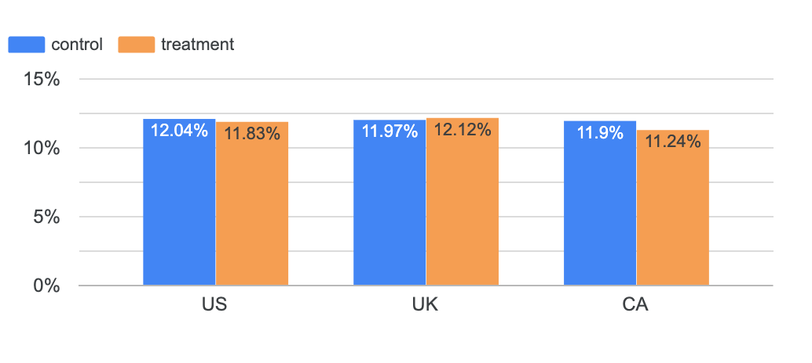
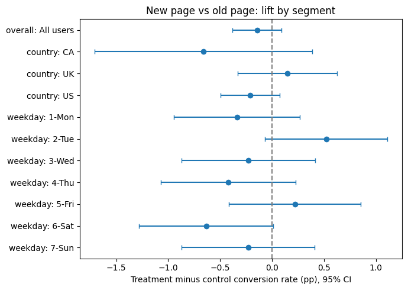

# A/B Test Analysis: Landing Page Redesign

An end-to-end analysis of a randomized A/B test comparing a new landing page against the current one. Data quality checks and exploratory analysis are done in SQL on Google BigQuery, statistical testing in Python, and results are summarized in a Looker Studio dashboard.

**Dashboard:** [Looker Studio report](DASHBOARD_LINK)



## Business question

An e-commerce company built a new version of its landing page and ran a 50/50 randomized test against the existing page. The question is whether to replace the old page with the new one, based on conversion rate (the share of users who purchased).

## Data

- **Source:** Udacity A/B testing project dataset (`ab_data.csv` and `countries.csv`), downloaded from [DATA_SOURCE_NAME](DATA_SOURCE_URL). The raw files are not included in this repository.
- **Size:** 294,478 rows, 290,584 unique users.
- **Period:** January 2, 2017 to January 24, 2017 (22 days).
- **Fields:** user ID, timestamp, assigned group (control or treatment), page shown (old or new), converted (0/1), and country (US, UK, CA) from a separate file.

## Method

1. **Load:** Both CSVs loaded into BigQuery with an explicit schema.
2. **Data quality (SQL):** Checked nulls, group/page mismatches, duplicate users, users logged in both groups, and sample ratio mismatch.
3. **Exploratory analysis (SQL):** Conversion by group, country, weekday, hour and day, plus a cumulative conversion trend, using CTEs and window functions.
4. **Statistical testing (Python):** Two-sided two-proportion z-test at alpha = 0.05, decided before running the test. The outcome is binary per user and the groups are independent and large, which is the standard case for this test. A chi-squared test on the 2x2 table was run as a cross-check. Confidence intervals were computed for the absolute and relative lift, along with the minimum detectable effect.
5. **Segment analysis:** Per-segment confidence intervals with Holm correction for multiple comparisons, interaction tests for whether the effect differs by segment, and a country-stratified estimate to check for Simpson's paradox.
6. **Business impact:** The lift translated into conversions per 100,000 users, and into yearly revenue under a stated assumption.

The Python results were written back to BigQuery so the dashboard reads the same numbers as the notebook.

## Data quality

| Check | Finding |
|---|---|
| Nulls | None |
| `converted` values | Only 0 and 1 |
| Group/page mismatch | 3,893 rows (1,928 control rows shown the new page, 1,965 treatment rows shown the old page) |
| Repeated users | 3,894 users with exactly 2 rows each; 1,895 of them were logged in both groups |
| Country join | All users matched a country |

Every mismatched row belonged to a user with two rows. This suggests returning users were sometimes logged against the wrong page or group on their second visit.

**Cleaning rule:** All rows of any user with more than one row or a mismatched row were removed, so each remaining user saw exactly one version.

| Stage | Rows | Users |
|---|---|---|
| Raw | 294,478 | 290,584 |
| Removed | 7,788 | 3,894 |
| Clean | 286,690 | 286,690 |

The removals were balanced across groups (3,909 control rows vs 3,879 treatment rows), so the cleaning did not favor either version.

**Sample ratio mismatch:** The clean data has 143,293 control and 143,397 treatment users (control share 0.49982). A chi-squared test against the intended 50/50 split gives chi2 = 0.038 and p = 0.846. That is well above the p < 0.001 alarm threshold, so there is no sign of an assignment problem.

## Results

| Metric | Value |
|---|---|
| Control conversion rate | 12.017% (17,220 of 143,293 users) |
| Treatment conversion rate | 11.873% (17,025 of 143,397 users) |
| Absolute lift | -0.145 pp (95% CI: -0.382 to +0.093 pp) |
| Relative lift | -1.20% (95% CI: -3.15% to +0.78%) |
| z / p-value | -1.19 / 0.232 |
| Chi-squared cross-check | chi2 = 1.427 (equals z squared), p = 0.232 |

**The new page shows no statistically significant difference in conversion.** The point estimate is slightly negative. The best plausible outcome is a relative lift under 1%.

**Power:** With about 143,000 users per group, the test could detect a change of 0.34 pp (2.83% relative) with 80% power. A meaningful improvement would very likely have been detected.

Detecting an effect as small as the one observed would require about 793,000 users per group, or roughly 122 days at the observed traffic of 13,031 users per day. That is more than five times the actual test length.

**Sensitivity check:** Analyzing users by assigned group instead of page shown (288,689 users) gives -0.163 pp (95% CI: -0.400 to +0.074 pp, p = 0.176). The conclusion does not depend on the cleaning rule.

### Segments



*Intervals are unadjusted 95% CIs. After Holm correction, no segment is significant.*

| Segment | Control CR | Treatment CR | Lift (pp) | 95% CI (pp) | p-value | p (Holm) |
|---|---|---|---|---|---|---|
| US | 12.043% | 11.832% | -0.211 | -0.495 to +0.073 | 0.145 | 1.000 |
| UK | 11.969% | 12.116% | +0.147 | -0.330 to +0.624 | 0.547 | 1.000 |
| CA | 11.897% | 11.236% | -0.661 | -1.710 to +0.387 | 0.216 | 1.000 |
| Mon | 12.298% | 11.960% | -0.338 | -0.943 to +0.267 | 0.273 | 1.000 |
| Tue | 11.684% | 12.207% | +0.522 | -0.067 to +1.112 | 0.082 | 0.741 |
| Wed | 12.096% | 11.868% | -0.228 | -0.872 to +0.416 | 0.488 | 1.000 |
| Thu | 12.168% | 11.747% | -0.421 | -1.068 to +0.225 | 0.202 | 1.000 |
| Fri | 11.546% | 11.766% | +0.220 | -0.416 to +0.856 | 0.498 | 1.000 |
| Sat | 12.387% | 11.754% | -0.633 | -1.279 to +0.012 | 0.055 | 0.546 |
| Sun | 11.964% | 11.734% | -0.230 | -0.869 to +0.408 | 0.480 | 1.000 |

- **The effect does not differ meaningfully by segment.** Interaction tests: country p = 0.272 (LR = 2.60, df = 2), weekday p = 0.144 (LR = 9.57, df = 6).
- **No Simpson's paradox.** The country-stratified lift (-0.144 pp) matches the pooled lift (-0.145 pp), and the Cochran-Mantel-Haenszel test agrees (odds ratio 0.986, p = 0.234). The country mix was balanced across groups, so composition cannot reverse the result.
- **Stable over time.** The cumulative difference was noisy in the first days, briefly positive on January 10 to 12, and stayed between -0.09 and -0.15 pp from January 15 onward. It did not trend toward zero, so there is no sign that an early negative reaction to the new design was fading.
- **Traffic by weekday.** Monday and Tuesday have more users because the test window contains four of each and three of every other weekday.

## Business impact

| Scenario | Conversions per 100K users | Conversions per year | Revenue per year (at $100 per conversion) |
|---|---|---|---|
| Point estimate | -145 | -6,883 | -$688,271 |
| 95% CI low | -382 | -18,176 | -$1,817,614 |
| 95% CI high | +93 | +4,411 | +$441,074 |

**Assumptions:**

- The dataset has no revenue data, and the $100 value per conversion is illustrative, not taken from the data.
- Yearly figures assume traffic continues at the test's observed rate of 13,031 users per day.
- The per-100K figures require no assumptions.

The most likely outcome of shipping is a small loss. The best plausible case is a small gain.

## Recommendation

**Do not ship the new page, and stop the test.**

- The new page did not improve conversion. The difference is not statistically significant, and the most optimistic plausible lift is under 1%.
- The test was large enough to detect a 2.83% relative change. A lift worth shipping would very likely have shown up.
- Running longer is not worth it. Resolving an effect this small would take about 122 days in total, and the observed direction is negative.
- The result holds across countries and weekdays, under country stratification, and when analyzed by assigned group.

**Suggested next steps:**

- Fix the logging issue that recorded 1.3% of users with inconsistent assignments before running the next test.
- Test a larger design change.
- Include revenue per user as a secondary metric.

## Limitations

- **One metric.** Conversion is the only outcome available. There is no revenue, order value, or guardrail metric.
- **Excluded users.** 3,894 users (1.3%) were excluded because of inconsistent logging. The sensitivity check suggests this does not change the result, but the cause is unknown.
- **UTC timestamps.** Hour-of-day results do not reflect users' local time.
- **Small effects.** Effects smaller than about 0.34 pp cannot be ruled out, though they would be too small to matter commercially.
- **Dataset.** This is a teaching dataset with limited documentation about the company, the product, and how users were assigned.

## Repository structure

```
sql/          BigQuery queries, numbered in run order (each file lists its result in a header comment)
notebooks/    Statistical analysis (Google Colab)
images/       Dashboard screenshot and lift chart
```

| File | Purpose |
|---|---|
| `sql/00_sanity_check.sql` | Row counts, date range, nulls |
| `sql/01_assignment_check.sql` | Group/page mismatches, `converted` values |
| `sql/02_exclusion_breakdown.sql` | Dirty users by type and group |
| `sql/02b_verify_dirty_users.sql` | Users with repeated rows and users in both groups |
| `sql/03_build_clean_table.sql` | Builds the analysis table |
| `sql/04_srm_check.sql` | Sample ratio mismatch, country coverage |
| `sql/05_conversion_by_group.sql` | Conversion by group |
| `sql/06_segment_breakdown.sql` | Conversion by country, weekday, hour, day |
| `sql/07_cumulative_conversion.sql` | Cumulative conversion by day |
| `sql/08_dashboard_cumulative.sql` | Dashboard table for the trend charts |
| `notebooks/ab_test_analysis.ipynb` | SRM p-value, z-test, confidence intervals, power, segments, business impact, dashboard results table |

## How to reproduce

1. Download `ab_data.csv` and `countries.csv` from the source above.
2. In BigQuery, create a dataset `ab_test`, and load them as `raw_ab_data` and `raw_countries`. Use these schemas and skip 1 header row:
   - `raw_ab_data`: `user_id:INTEGER, event_ts:TIMESTAMP, test_group:STRING, landing_page:STRING, converted:INTEGER`
   - `raw_countries`: `user_id:INTEGER, country:STRING`
3. Run the SQL files in numbered order.
4. Open the notebook in Google Colab, set `PROJECT` to your project ID, and run all cells.
